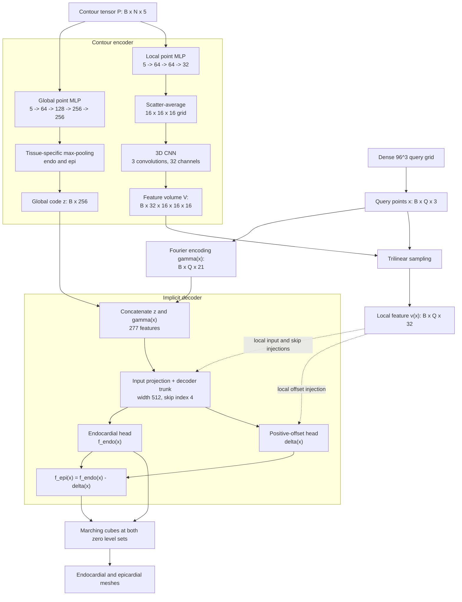

# Proposed Model Architecture

## Purpose

The model reconstructs left-ventricular (LV) endocardial and epicardial surfaces from sparse short-axis (SAX) contours. It represents both surfaces as continuous implicit fields, allowing them to be evaluated at arbitrary 3D coordinates before mesh extraction.

The model has four main stages:

1. sparse contour input;
2. global and local contour encoding;
3. phase-conditioned implicit decoding;
4. coupled field prediction and surface extraction.

## 1. Input Representation

For each case, the model receives a padded contour tensor

$$
P \in \mathbb{R}^{B \times N \times 5}
$$

and a validity mask

$$
M \in \{0,1\}^{B \times N}.
$$

Each valid point is

$$
p_i = (x_i, y_i, z_i, t_i, q_i),
$$

where:

| Feature | Meaning |
| --- | --- |
| $x_i,y_i,z_i$ | Normalised 3D coordinates |
| $t_i$ | Tissue label: endocardium or epicardium |
| $q_i$ | Cardiac phase: end diastole or end systole |

The input contains contour points only. Image intensities and template meshes are not supplied to the network.

## 2. Global Contour Encoder

A shared point MLP processes every contour point independently:

$$
5 \rightarrow 64 \rightarrow 128 \rightarrow 256 \rightarrow 256.
$$

ReLU activations follow the first three linear layers. The resulting point features are pooled separately by tissue:

$$
z_{\mathrm{endo}} = \max_{i \in \mathcal{E}} h_i,
\qquad
z_{\mathrm{epi}} = \max_{i \in \mathcal{P}} h_i.
$$

The two 256-dimensional descriptors are concatenated and projected back to 256 dimensions:

$$
z = W_z [z_{\mathrm{endo}},z_{\mathrm{epi}}] + b_z,
\qquad
z \in \mathbb{R}^{B \times 256}.
$$

Max-pooling makes the global representation invariant to contour-point order. If one tissue is absent, the implementation falls back to max-pooling over all valid points for that branch.

## 3. Local Contour-Volume Encoder

The local branch preserves spatial information that would be lost in a single global vector.

### Point features

A second shared point MLP computes 32-dimensional features:

$$
5 \rightarrow 64 \rightarrow 64 \rightarrow 32.
$$

The first two linear layers use ReLU activations.

### Voxel aggregation

The point features are assigned to a regular $16^3$ grid covering the normalised extent $[-1.8,1.8]^3$. Features falling in the same voxel are averaged. This produces an initial tensor with shape

$$
B \times 32 \times 16 \times 16 \times 16.
$$

### 3D refinement

The volume is refined by three $3 \times 3 \times 3$ convolutions with 32 channels:

1. Conv3D, GroupNorm, ReLU;
2. Conv3D, GroupNorm, ReLU;
3. Conv3D.

The refined local feature volume is

$$
V \in \mathbb{R}^{B \times 32 \times 16 \times 16 \times 16}.
$$

For every query coordinate $x$, trilinear interpolation samples the local context:

$$
v(x) = \operatorname{Interp}(V,x),
\qquad
v(x) \in \mathbb{R}^{32}.
$$

## 4. Fourier Positional Encoding

A query point $x \in \mathbb{R}^3$ is expanded using $L=3$ frequency bands:

$$
\gamma(x) = [x,\sin(2^0\pi x),\cos(2^0\pi x),\ldots,
\sin(2^{L-1}\pi x),\cos(2^{L-1}\pi x)].
$$

Its dimension is

$$
\dim \gamma(x) = 3 + 6L = 21.
$$

The global code and positional encoding form the decoder input

$$
h_{\mathrm{in}} = [z,\gamma(x)] \in \mathbb{R}^{277}.
$$

## 5. Implicit Decoder

The decoder maps each query coordinate and its conditioning features to continuous field values.

| Property | Configuration |
| --- | --- |
| Decoder input | $[z,\gamma(x)]$, 277 dimensions |
| Input projection | $277 \rightarrow 512$ |
| Hidden width | 512 |
| Configured hidden layers | 8 |
| Skip index | 4 |
| Activation | Softplus |
| Global conditioning | Present at the input and skip connection |
| Local conditioning | Added at the input, skip connection, and offset head |

The implementation contains an input projection followed by a configured list of eight hidden linear layers. At skip index 4, the current hidden state is concatenated with $h_{\mathrm{in}}$ before the next 512-dimensional projection.

The local feature is injected additively through learned projections:

$$
h_0 = \operatorname{Softplus}(W_{\mathrm{in}}h_{\mathrm{in}} + W_{\mathrm{loc,in}}v(x)),
$$

and, at the skip layer,

$$
h_{s+1} = \operatorname{Softplus}
\left(W_s[h_s,h_{\mathrm{in}}] + W_{\mathrm{loc,skip}}v(x)\right).
$$

These local projections are zero-initialised when the v2 network is created, allowing it to reproduce the pretrained global-only backbone before fine-tuning.

## 6. Coupled Output Fields

The decoder trunk produces a hidden feature

$$
h(x) \in \mathbb{R}^{512}.
$$

### Endocardial field

A linear head predicts the endocardial signed-distance field:

$$
f_{\mathrm{endo}}(x) = W_{\mathrm{endo}}h(x) + b_{\mathrm{endo}}.
$$

### Positive offset

A second head predicts a raw offset value. The local feature contributes through a separate $32 \rightarrow 64 \rightarrow 1$ path:

$$
r(x) = W_{\delta}h(x) + b_{\delta} + g_{\mathrm{loc}}(v(x)).
$$

For the bounded configuration documented in the thesis,

$$
\delta(x) = \tau_{\min} +
(\delta_{\mathrm{cap}}-\tau_{\min})\sigma(r(x)),
$$

with

$$
\tau_{\min}=0.05,
\qquad
\delta_{\mathrm{cap}}=0.45
$$

in normalised units.

The epicardial field is coupled to the endocardial field by

$$
f_{\mathrm{epi}}(x) = f_{\mathrm{endo}}(x) - \delta(x).
$$

Since $\delta(x)>0$, the two implicit fields remain ordered. However, $\delta$ is a field-value separation, not anatomical wall thickness and not a Euclidean distance between the extracted surfaces.

### Optional v2 headroom

The implementation can optionally add a soft-hinge headroom term when `delta_headroom` is enabled:

$$
\delta(x) = \tau_{\min} + (\delta_{\mathrm{cap}}-\tau_{\min})\sigma(r)
+ s\,\frac{\operatorname{softplus}(\beta(r-r_0))}{\beta}.
$$

This extension removes the hard upper ceiling while leaving values below the saturation knee nearly unchanged. It is configuration-dependent; the bounded equation above is the architecture described in the current thesis methodology.

## 7. Surface Extraction

At inference time, the encoder is evaluated once per case. The decoder is then queried in batches on a dense $96^3$ grid covering a padded contour bounding box.

Two surfaces are extracted independently:

$$
\mathcal{S}_{\mathrm{endo}} = \{x \mid f_{\mathrm{endo}}(x)=0\},
$$

$$
\mathcal{S}_{\mathrm{epi}} = \{x \mid f_{\mathrm{epi}}(x)=0\}.
$$

Marching cubes converts the zero level sets into triangle meshes. Component filtering and hole clean-up are applied after extraction. Anatomical wall thickness is subsequently measured between these meshes, not read directly from $\delta(x)$.

## 8. Tensor Summary

| Symbol | Shape | Description |
| --- | ---: | --- |
| $P$ | $B \times N \times 5$ | Padded contour tensor |
| $M$ | $B \times N$ | Valid-point mask |
| $z$ | $B \times 256$ | Global shape code |
| $V$ | $B \times 32 \times 16^3$ | Local feature volume |
| $x$ | $B \times Q \times 3$ | Query coordinates |
| $\gamma(x)$ | $B \times Q \times 21$ | Fourier positional encoding |
| $v(x)$ | $B \times Q \times 32$ | Sampled local feature |
| $h(x)$ | $B \times Q \times 512$ | Decoder hidden feature |
| $f_{\mathrm{endo}}(x)$ | $B \times Q$ | Endocardial field |
| $f_{\mathrm{epi}}(x)$ | $B \times Q$ | Epicardial field |
| $\delta(x)$ | $B \times Q$ | Positive field offset |

## 9. Implementation Sources

The architecture is implemented in:

- `test-new-model/cardiosdf2/model.py`: v2 local volume, local injections, coupled decoder, and optional headroom;
- `scripts/eval_demo/cardiosdf_model.py`: Fourier encoding, global PointNet encoder, baseline decoder, and dense-grid inference;
- `chapters/03-methodology.tex`: thesis-facing architecture description and final documented settings;
- `scripts/fig_model_architecture.py`: architecture figure generator.
